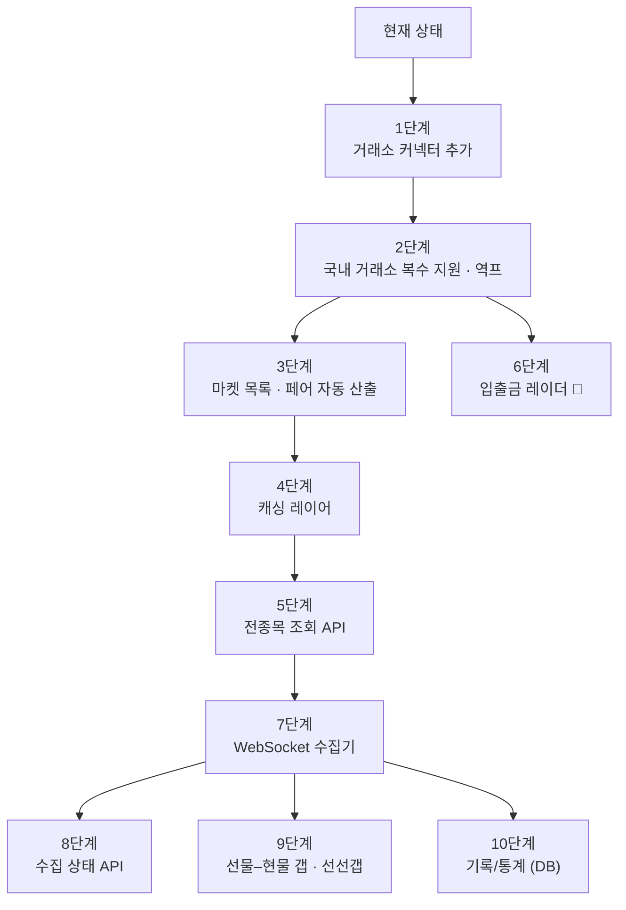

# MarketLens 백엔드 구현 로드맵

목업(**트레이딩룸** 대시보드)을 채우기 위해 필요한 작업을 **난이도 순**으로 정리했다.
아래로 갈수록 어렵고, 대체로 위 단계에 의존한다.

- 대상 화면: 탭 6개 (`실시간 스프레드` · `기록/통계` · `선물–현물 갭` · `선선갭` · `수집 상태` · `입출금 레이더`)
- 규모: **8개 거래소 · 24개 코인 · 176 페어 · 실시간 갱신**
- 현재: **2개 거래소 · 코인 1개씩 요청 · REST 폴링**

---

## 지금까지 된 것

| 영역 | 상태 |
|---|---|
| `BaseExchange` 추상화 + 자동 등록 레지스트리 | ✅ |
| 업비트 · 바이낸스 커넥터 (호가 / 마지막 체결가) | ✅ |
| `/orderbook` `/compare` `/premium` `/arbitrage` `/exchanges` `/health` | ✅ |
| USDT/KRW 환율 (1초 TTL 캐시) | ✅ |
| 호가창 소진 계산 (시장가 체결 · 슬리피지) | ✅ |
| 테스트 97개 | ✅ |

---

## 전체 흐름



`🔑` = 사용자의 API 키 발급이 선행되어야 하는 단계.

---

## 1단계 — 거래소 커넥터 추가

**난이도** ⭐☆☆☆☆ · **가장 먼저 할 것**

아키텍처가 이미 이걸 위해 설계돼 있다. `connectors/` 에 파일 하나 만들면
`/exchanges` `/compare` `/premium` `/arbitrage` 전부에 자동 반영된다.
**레지스트리도 라우터도 서비스도 건드리지 않는다.**

### 할 일

거래소당 `BaseExchange` 를 상속해 메서드 5개만 구현한다.

| 순서 | 거래소 | 비고 |
|---|---|---|
| 1 | **빗썸** | 국내 2번째. 목업의 `기준 국내 거래소` 필터에 필요 |
| 2 | Bybit | REST 구조가 바이낸스와 유사 |
| 3 | Gate.io | |
| 4 | MEXC | |
| 5 | Bitget | |
| 6 | Hyperliquid | **DEX라 API 형태가 다름.** 마지막에 |

각 거래소마다 확인할 것:

- 호가 엔드포인트와 **최대 단계 수** (업비트는 30, 바이낸스는 5000)
- 마지막 체결가 엔드포인트 — **"윈도우 끝" 이 아니라 진짜 체결 시각인지 반드시 검증**
  (바이낸스 `ticker/24hr` 의 `closeTime` 이 62분 차이 났던 사례가 있다)
- 없는 마켓일 때의 상태 코드/본문 → `MarketNotFoundError` 매핑
- Rate limit 방식 (개수 기준 vs weight 기준)

### 완료 기준

```bash
curl "http://localhost:8000/exchanges"          # 8곳이 나온다
curl "http://localhost:8000/premium?base=BTC"   # 6개 해외 거래소 프리미엄이 나온다
```

`tests/test_exchanges.py` 의 `TestConnectorContract` 가 새 커넥터를 자동으로 검증한다.

### 주의

- `quote_currencies` 에 `USDT` 가 없으면 `/premium` 대상에서 빠진다
- 국내 거래소(빗썸)를 넣으면 2단계 없이는 `/premium` 이 여전히 업비트만 기준으로 쓴다

---

## 2단계 — 국내 거래소 복수 지원 · 역프 계산

**난이도** ⭐⭐☆☆☆

목업의 `기준 국내 거래소: 모두 / 업비트 / 빗썸` 과 `기준 보기: 김프 / 역프` 를 채운다.

### 할 일

**(a) 국내 거래소 하드코딩 제거**

지금은 `settings.krw_reference_exchange = "upbit"` 로 고정이다.

- `/premium` 에 `domestic` 파라미터 추가 (생략 시 KRW 마켓을 가진 전체)
- 환율도 거래소별로 따로 뽑아야 한다 — 빗썸 `USDT/KRW` 와 업비트 `KRW-USDT` 는 값이 다르다
- `FxService` 캐시 키를 `(거래소, 기준)` 으로 확장

**(b) 역방향(역프) 계산**

목업 하단 정의를 그대로 따른다.

```
순방향 = 해외 매수 → 국내 매도   (지금 구현된 것)
역방향 = 국내 매수 → 해외 매도
```

- `PremiumResult` 에 `direction` 추가
- 응답에 순/역 둘 다 담거나 파라미터로 선택

**(c) 페어 단위 결과**

목업의 `176 페어` 는 **국내 N곳 × 해외 M곳 × 코인** 조합이다.
지금 `/premium` 은 국내 1곳 고정이라 페어 개념이 없다.

### 완료 기준

```bash
curl "http://localhost:8000/premium?base=BTC&domestic=bithumb"
curl "http://localhost:8000/premium?base=BTC&direction=reverse"
```

### 주의

**환율을 거래소별로 분리하는 게 핵심이다.** 빗썸 가격을 업비트 환율로 환산하면
빗썸-업비트 간 테더 가격차가 그대로 프리미엄 오차가 된다.

---

## 3단계 — 마켓 목록 · 추적 페어 자동 산출

**난이도** ⭐⭐☆☆☆

목업 우상단 `24개 코인 · 176 페어` 를 만들어낸다.

### 할 일

- `BaseExchange.fetch_markets()` 추가 → 거래소별 상장 코인 목록
  - 업비트 `GET /v1/market/all`
  - 바이낸스 `GET /api/v3/exchangeInfo`
- `GET /markets` — 거래소별 상장 목록
- `GET /markets/pairs` — **교집합 계산**: 국내·해외 양쪽에 있는 코인만 추적 대상
- 목록은 자주 안 바뀌므로 **긴 TTL 캐시**(10분 이상)

### 완료 기준

```bash
curl "http://localhost:8000/markets/pairs"
# { "coins": 24, "pairs": 176, "items": [...] }
```

### 주의

지금은 "없는 코인은 거래소가 404 로 알려준다"에 의존한다. 전종목을 돌리려면
**미리 교집합을 알아야** 헛된 호출을 안 한다. 4·5단계의 전제 조건이다.

---

## 4단계 — 캐싱 레이어

**난이도** ⭐⭐⭐☆☆ · **여기서부터 성격이 바뀐다**

지금은 요청이 올 때마다 거래소를 호출한다. 176 페어 화면에서는 **즉시 한도 초과**다.

### 왜 필요한가

| 거래소 | 한도 | 176페어를 한 바퀴 도는 시간 |
|---|---|---|
| 업비트 | 그룹당 **초당 10회** | **약 18초** |
| 바이낸스 | 분당 6,000 weight | 약 9초 (weight 5 기준) |

화면 하나 그리는 데 18초가 걸린다. 캐싱 없이는 성립하지 않는다.

### 할 일

- 호가/체결가에 **짧은 TTL 캐시**(0.5~2초) 도입
- 키: `(거래소, 심볼, 시장구분, depth)`
- **동시 요청 병합(single-flight)** — 같은 키에 요청이 몰리면 실제 호출은 1번만
- 캐시 히트/미스 지표 노출

### 완료 기준

동일 심볼을 초당 100번 호출해도 거래소 호출은 초당 1~2회를 넘지 않는다.

### 주의

**TTL 을 너무 늘리면 프리미엄이 틀어진다.** 국내·해외 가격의 조회 시각이 벌어지면
그 사이 가격 변동이 그대로 프리미엄 오차가 된다. 1초 이하를 권장한다.

---

## 5단계 — 전종목 조회 API

**난이도** ⭐⭐⭐☆☆ · 3·4단계 의존

목업의 메인 테이블(전종목 김프 목록)을 한 번에 채운다.

### 할 일

- `GET /premium/all` — 추적 페어 전체의 프리미엄
- 정렬 (`김프 ▾`), 필터:
  - `min_premium` (하이라이트 임계값 1.5%)
  - `domestic` / `exchanges` (거래소 선택)
  - `price_basis` (`현재가` / `슬리피지 반영`)
- **부분 실패 허용** — 일부 거래소가 죽어도 나머지는 반환

### 완료 기준

```bash
curl "http://localhost:8000/premium/all?min_premium=1.5"
# 176 페어 결과가 1초 안에
```

### 주의

`슬리피지 반영` 옵션은 전종목에 `/arbitrage` 로직을 도는 것이라 훨씬 무겁다.
**금액 파라미터가 필요**하고, 호가 깊이도 더 받아와야 한다.

---

## 6단계 — 입출금 레이더 🔑

**난이도** ⭐⭐⭐☆☆ · **사용자의 API 키 발급이 선행되어야 함**

목업 테이블의 `출금 가능` / `출금 중단` / `입금 가능` / `입금 중단` 뱃지와
`입출금 가능만` 필터, 그리고 `입출금 레이더` 탭.

### 선행 작업 (사용자가 해야 할 일)

| 거래소 | 발급 위치 | 켤 권한 | **반드시 끌 권한** |
|---|---|---|---|
| 업비트 | 마이페이지 → Open API 관리 | 자산 조회 | 주문, **출금** |
| 바이낸스 | API Management | Enable Reading | **Enable Withdrawals**, 거래 |

> 업비트는 **호출 서버의 공인 IP 등록**이 필수다. 로컬/배포 IP 모두 등록해야 한다.
> 조회만 하므로 출금 권한은 절대 켜지 않는다.

### 할 일

- 인증 계층 추가 — 업비트 JWT(HS256), 바이낸스 HMAC-SHA256
- `BaseExchange.fetch_currencies()` 추가
  - 업비트 `GET /v1/status/wallet` → `wallet_state` (`working`/`withdraw_only`/`deposit_only`/`paused`)
  - 바이낸스 `GET /sapi/v1/capital/config/getall` → `networkList[].depositEnable` / `withdrawEnable`
- `GET /currencies` — 코인 × 네트워크별 입출금 상태 + 출금 수수료 + 최소 출금량
- 상태 변화 감지 (`출금 가능 → 중단` 이벤트) ← **레이더 탭의 핵심**
- `/premium/all`, `/arbitrage` 응답에 입출금 상태 병합

### 완료 기준

```bash
curl "http://localhost:8000/currencies?coin=XRP"
# 거래소 × 네트워크별 입출금 가능 여부
```

`/arbitrage` 의 `warnings` 에 "매수처 출금 정지 중" 이 뜬다.

### 주의

- **키 유출 방지**: `.env` 커밋 금지, 로그에 키가 찍히지 않게
- 입출금 상태는 자주 안 바뀌므로 **긴 TTL 캐시**(1~5분)로 충분하다
- **김프가 높아도 출금이 막혀 있으면 차익거래가 불가능하다.** 이 단계가 없으면
  `/arbitrage` 결과가 실전에서 오답이 될 수 있다

---

## 7단계 — WebSocket 실시간 수집기

**난이도** ⭐⭐⭐⭐☆ · **아키텍처 전환**

목업 좌상단 `● 실시간 수집 중` 과 초 단위 갱신을 구현한다.

### 왜 필요한가

4단계 캐싱으로도 한계가 있다. REST 폴링은 **요청이 있어야 갱신**되지만,
레이더 화면은 **상시 최신 상태**를 유지해야 한다.

### 구조 전환

```
[지금]  요청 → REST 호출 → 응답            (매번 수십 ms 대기)
[목표]  수집기 ← WS 푸시 ← 거래소
        요청 → 메모리 조회 → 응답           (1ms 미만)
```

### 할 일

- `BaseExchange` 에 스트리밍 인터페이스 추가 (기존 REST 구조는 유지)
  - 업비트 `wss://api.upbit.com/websocket/v1`
  - 바이낸스 `wss://stream.binance.com:9443/ws/{symbol}@depth10@100ms`
- 백그라운드 수집 태스크 — 앱 `lifespan` 에 연결
- 인메모리 스토어 (심볼별 최신 호가/체결가)
- **재연결·백오프·구독 재등록**
- REST 폴백 — WS 끊기면 자동 전환

### 완료 기준

- API 응답 시간이 수십 ms → **1ms 미만**
- rate limit 소모가 사실상 0
- 연결을 강제로 끊어도 자동 복구된다

### 주의

**가장 난이도가 높은 단계다.** 재연결, 순서 보장, 스냅샷+델타 동기화(바이낸스 depth는
스냅샷 후 델타를 적용해야 정확하다), 메모리 관리를 모두 다뤄야 한다.
**여러 프로세스로 띄우면 각자 연결을 잡으므로** 수집기를 분리하는 설계도 검토해야 한다.

---

## 8단계 — 수집 상태 API

**난이도** ⭐⭐☆☆☆ · 7단계 의존

목업의 `수집 상태` 탭과 상단 `8곳 중 7곳 정상 · MEXC 끊김 · 1곳 지연`.

### 할 일

- `GET /status` — 거래소별 연결 상태, 마지막 수신 시각, 지연, 에러율
- 상태 판정: `정상` / `지연` / `끊김`
- 기존 `latency_ms` 를 집계해 통계로

### 완료 기준

```bash
curl "http://localhost:8000/status"
# { "healthy": 7, "total": 8, "exchanges": [{ "id": "mexc", "state": "disconnected", ... }] }
```

---

## 9단계 — 선물–현물 갭 · 선선갭

**난이도** ⭐⭐⭐⭐☆

탭 2개를 채운다. **선물 도메인 지식이 추가로 필요하다.**

### 할 일

**(a) 선물–현물 갭 (베이시스)**

- `GET /futures/basis` — 무기한 선물 가격 vs 현물 가격
- **펀딩비**가 핵심 — `GET /fapi/v1/premiumIndex`
- 김프와 결합: 국내 현물 매수 + 해외 선물 숏 = 헤지된 김프 진입

**(b) 선선갭 (캘린더 스프레드)**

- 만기가 다른 선물 간 가격차
- **분기 선물(quarterly) 지원이 필요** — 지금은 무기한만 다룬다
- 심볼 체계 확장 (`BTCUSDT_240628` 형태)

### 주의

- 선물 rate limit 이 현물의 **절반 이하**(2,400/분)라 더 빡빡하다
- 업비트에는 선물이 없으므로 국내 쪽은 항상 현물이다

---

## 10단계 — 기록/통계 (DB 도입)

**난이도** ⭐⭐⭐⭐⭐ · **인프라가 늘어난다**

`기록/통계` 탭. 지금까지는 전부 실시간 조회라 저장소가 없었다.

### 할 일

- 시계열 저장소 도입 (TimescaleDB / InfluxDB / ClickHouse)
- 수집기가 프리미엄 스냅샷을 주기적으로 적재
- `GET /history/premium` — 기간별 프리미엄 추이
- 통계: 평균/최대/최소 김프, 임계값 초과 빈도, 시간대별 패턴
- **보존 정책** — 176페어 × 1초 = 하루 1,500만 행

### 주의

**운영 부담이 실제로 생기는 첫 단계다.** DB 백업·마이그레이션·디스크 용량 관리가
따라온다. 앞 단계들과 달리 "코드만 짜면 되는" 일이 아니다.

---

## 요약

| 단계 | 내용 | 난이도 | 선행 | 채우는 화면 |
|---|---|:---:|---|---|
| 1 | 거래소 커넥터 6곳 추가 | ⭐ | — | 거래소 필터 |
| 2 | 국내 복수 지원 · 역프 | ⭐⭐ | 1 | 기준 거래소, 김프/역프 |
| 3 | 마켓 목록 · 페어 산출 | ⭐⭐ | 1 | `24개 코인 · 176 페어` |
| 4 | 캐싱 레이어 | ⭐⭐⭐ | 3 | (성능 기반) |
| 5 | 전종목 조회 | ⭐⭐⭐ | 3,4 | **메인 테이블** |
| 6 | 입출금 레이더 🔑 | ⭐⭐⭐ | 2 | **입출금 뱃지·레이더 탭** |
| 7 | WebSocket 수집기 | ⭐⭐⭐⭐ | 5 | `● 실시간 수집 중` |
| 8 | 수집 상태 | ⭐⭐ | 7 | 수집 상태 탭 |
| 9 | 선물 갭 · 선선갭 | ⭐⭐⭐⭐ | 7 | 탭 2개 |
| 10 | 기록/통계 | ⭐⭐⭐⭐⭐ | 7 | 기록/통계 탭 |

### 권장 진행 순서

**1 → 2 → 3 → 4 → 5** 를 먼저 끝내면 **메인 화면(실시간 스프레드 탭)이 동작한다.**
목업의 가장 큰 부분이고, 여기까지는 기존 구조를 크게 바꾸지 않는다.

**6단계(입출금)는 키만 준비되면 언제든 병행 가능하다.** 2단계 이후 아무 때나 끼워도
되고, 난이도도 중간이다. 다른 단계와 의존이 적어 병렬 작업에 적합하다.

**7단계부터가 진짜 전환점이다.** 여기서 "요청 시 조회" 에서 "상시 수집" 으로 구조가
바뀐다. 5단계까지 만들어 실사용 부하를 확인한 뒤 들어가는 것을 권한다.
